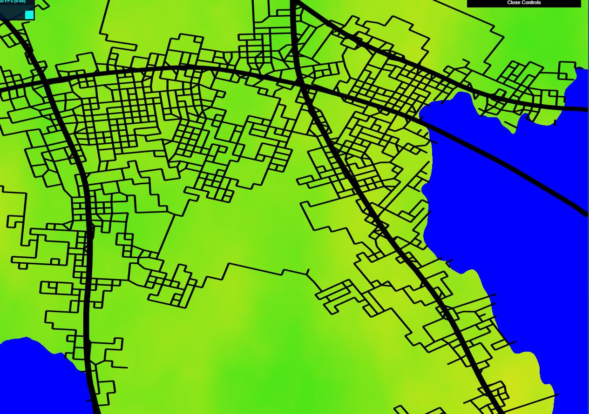

# hw05-road-generation

## Features:
- road generation using pseudo L-system
  - the generation of the Highway and neighborhood are seperated, the Highway is generated with an auto direction detection function: which basically
  radiates detection rays into sourrounding for sampling of population density, and then use the highest density direction as target to diverge the forward direction of turtle just a little bit
  (we don't want being too dramatic in highway angles as they generally behave more subtle in real life). The neighbor hood on the other hand , are required to be 
  more compact and denser, thus I simply generate two new turtles at each highway segments' two end points, the newly generated turtles will march
  toward directions that exhibits higher population density as they choose their own direction based on this information just as the highways(there are only three directions: right,left,forward), the newly generated will randomly get
  pushed into a turtle stack which will pop turtle in the future when an intesection appears for newly generated edges with older ones. 
- highway detection for population density area
- neighborhood detection for population and elevation
- road snapping when colliding
- highway able to cross water while neighborhood can't
