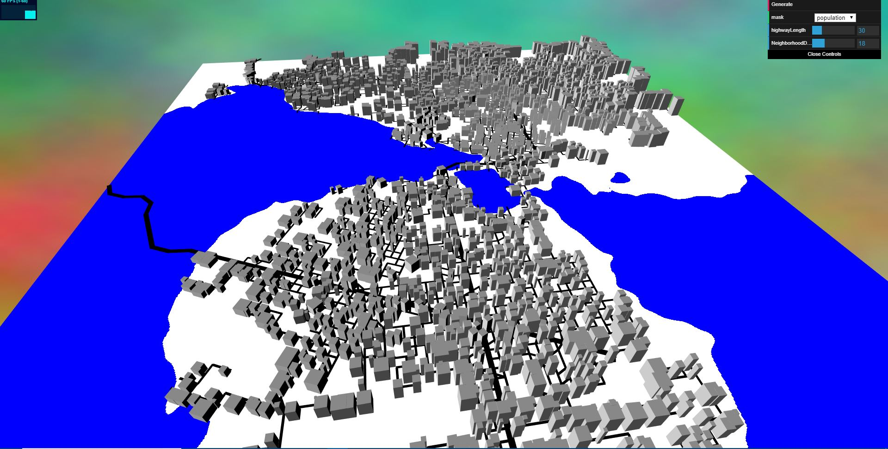
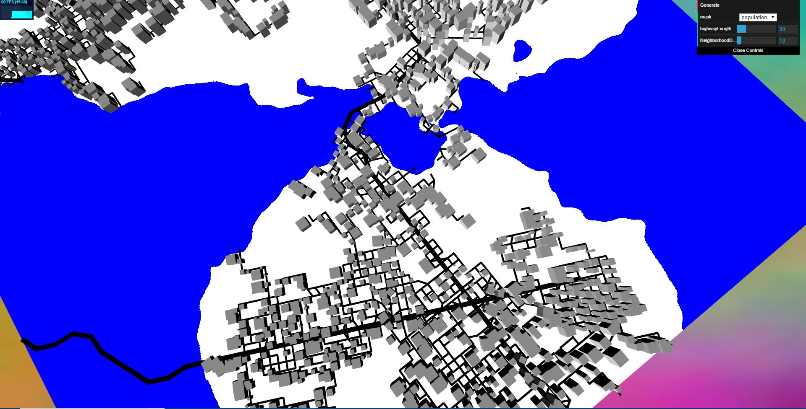

# Homework 6: City Generation

## current progress : building generation

## Features:
- **Acceleration structure** , I have been bothered by the performance issue caused by checking every branch in the scene when doing intersection and conjunction checking, with the increasing number of branches generated by turtle, this could be a really heavy burden, then I realized that such large amount of checking is not neccessary at all, recall from the first assaingment in GPU programming course, I only need to check a sorounding area within certain range by using a grid structure, the index of the grid cells will be corresponding to the current position of the checking point, and each time I'm generating a branch(road or highway) I will push this road into a corresponding road array inside a 2-Dimensional array storing the road arrays. therefore in the future when doing the checking, the time complexity is greatly decreased since I will only be checking ```roadnum/numcells```instead of ```roadnum```, the performancce boost is really helpful for me to add more road related building features which I will describe later.
- **Rasterize the Map of road and water**: instead of rasterize these stuff on CPU, I chosed to use Framebuffer and texture to acheive this, there will be in general three passes, first pass, do the instanced rendering of road(a bunch of quad) render to road texture by framebuffer, second pass, render the elevation texture(water information), third pass take in two above texture and combine them in fragment shader, then write to CPU by readpixels for furture use
- **Building generation**: first generate a 100X100 grid extending the entire scene, then foreach cell in the grid generate a random point in it, then use the rasterized buffer from the previous step to determine if we place building here or not, if decided to place one, then record the translation information as mat4


- **Road sensitive buildings**: as can be noticed from the image above, the shape of the building is affected by roads in several aspects: the building is aligning with the heading of the road around it, and is resized depending on the size of the block it is in
  - Size of the building, here is when the acceleration structure I mentioned above come in handy, each of the building points will try to get a closest point to another road in the acceleration cell, and the closest point will be the restriction of the current building, this information will again be recorded as mat4(scale)
  - Orientation of the building : similarily, we check the closest point, this time we will get the owner road of the point, and get the orientation of that road, and use a quaternion to initilize the rotation matrix...


For this assignment, you will generate a collection of 3D buildings within the road networks you created for the previous assignment.

For this assignment, you will generate a network of roads to form the basis of a city using a modified version of L-systems. As in homework 4, you will be using instanced rendering to draw your road networks.

## Provided Resources
You can use any base code for this assignment, so we haven't provided
anything specific for you. We have included the paper [Real-time Procedural Generation of 'Pseudo Infinite' Cities](procedural_infinite_cities.pdf) for your reference. For visual inspiration, you might refer to Emily's [City Forgery](http://www.emilyhvo.com/city-forgery/) project.

## Assignment Requirements
- __(5 points)__ Based on the code you wrote for the previous assignment, create a 3D model of your terrain. You might consider using the subdivided plane we provided with homework 1. Since the road generation assignment was entirely 2D, your terrain need not have changes in elevation, since that would alter the placement of roads and buildings. The only elevation changes we require are having the water exist at a lower elevation than the land, with a small slope between the two.

- __(5 points)__ Using whatever visual representation you wish, draw your roads on top of your terrain model. For the simplest representation, use instanced rendering to draw rectangular prisms slightly above the ground.
- __(10 points)__ On the CPU, create a high-resolution 2D grid that spans your entire scene. "Rasterize" every road in this grid with an adjustable line thickness to demarcate areas where buildings cannot be placed. Do the same with any water in your terrain. This grid will be used in the next section to determine valid locations for buildings.
- __(10 points)__ Generate a collection of randomly scattered 2D points in your building placement validity grid, removing any points that fall within cells already occupied by roads or water. At each of these points, you will place a building generated based on the specifications in the next section.
- __(20 points)__ To create building geometry, you will follow the method illustrated in figure 3 of [Real-time Procedural Generation of 'Pseudo Infinite' Cities](procedural_infinite_cities.pdf). Beginning at a predetermined top height, generate some n-sided polygon and extrude it downward a certain distance. After creating this first layer, create an additional layer beneath it that has the form of two polygons combined together and extruded downward. Repeat until your building has reached the ground. You will be creating the structure of these buildings as VBO data on the CPU.
- __(25 points)__ Once you have the basics of building generation working, you will need to refine your algorithm to create art-directed procedural buildings. Your city should contain buildings that follow these guidelines:
  - Buildings in your city should not be uniform in appearance. The higher the city's population density, the more the buildings should resemble skyscrapers. In areas of lower density, the buildings should be shorter and look more residential. Think office buildings versus row homes. Areas of medium population should contain buildings that are of medium height and which look more like multi-story offices or shops. Don't feel constrained by the building generation algorithm from the previous section; add slanted roofs and other features to your buildings if you wish.
  - The texturing of your buildings should be procedurally generated within a shader. Use all of the techniques you practiced in the first three homework assignments to polish your buildings' appearances. The overall aesthetic of your city is up to you (e.g. cyberpunk versus modern versus renaissance) but the procedural texturing should look intentional. Include windows, doors, lights, and other details you deem necessary to make your buildings look natural.
- __(10 points)__ Make use of artistic lighting as we discussed during the environmental setpiece assignment. You should include several directional lights, as discussed in [IQ's article on artistic lighting](http://iquilezles.org/www/articles/outdoorslighting/outdoorslighting.htm), to ensure your scene has adequate illumination. There should never be any purely black shadows in your scene.
- __(5 points)__ Your scene should include a procedural sky background as so many of your other assignments have. Make sure it is congruent with your lighting setup and the aesthetics of your city.
- __(10 points)__ Following the specifications listed
[here](https://github.com/pjcozzi/Articles/blob/master/CIS565/GitHubRepo/README.md),
create your own README.md, renaming the file you are presently reading to
INSTRUCTIONS.md. Don't worry about discussing runtime optimization for this
project. Make sure your README contains the following information:
    - Your name and PennKey
    - Citation of any external resources you found helpful when implementing this
    assignment.
    - A link to your live github.io demo (refer to the pinned Piazza post on
      how to make a live demo through github.io)
    - An explanation of the techniques you used to generate your L-System features.
    Please be as detailed as you can; not only will this help you explain your work
    to recruiters, but it helps us understand your project when we grade it!


## Extra Credit (Up to 20 points)
- If you did not do so for the previous assignment, implement additional road layouts as described in Procedural Modeling of Cities
  - Radial road networking: The main roads follow radial tracks around some predefined centerpoint
  - Elevation road networking: Roads follow paths of least elevation change
- Use shape grammars to further refine the structure of your buildings
- Create fully 3D terrain and adjust the placement of your buildings and roads based on the slope of your terrain.
- In the vein of Emily's procedural city, use the BioCrowds algorithm to create agents that seek some goal point by navigating the terrain covered by roads. 
- Add any polish features you'd like to make your visual output more interesting