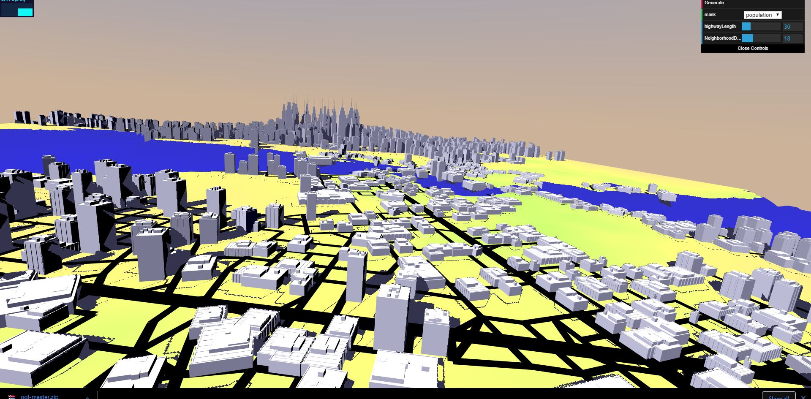
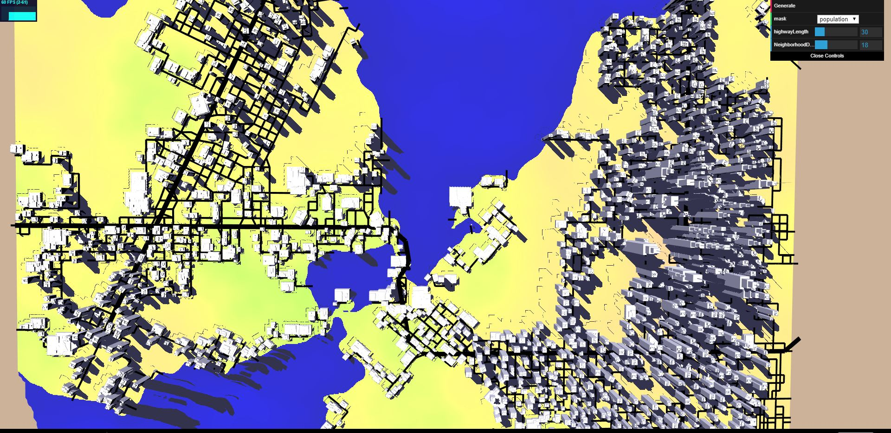
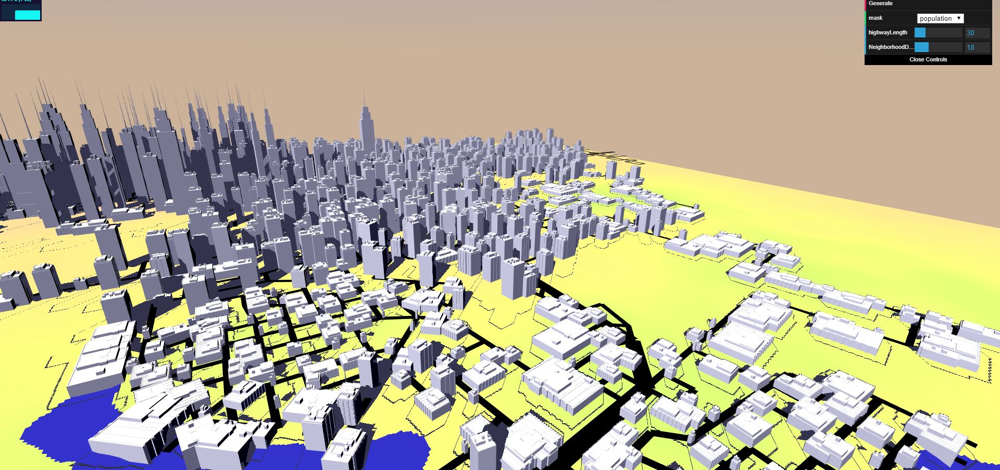
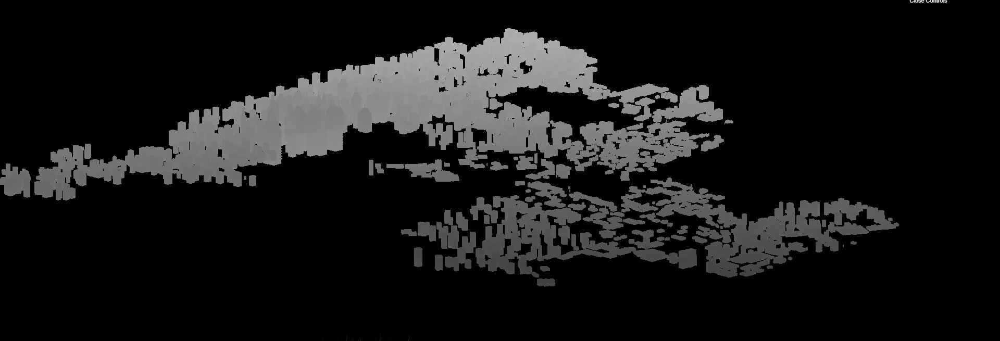
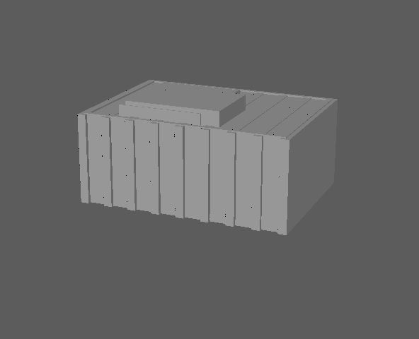
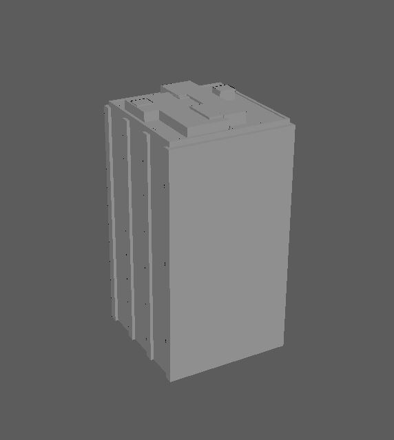
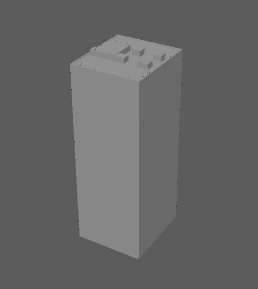
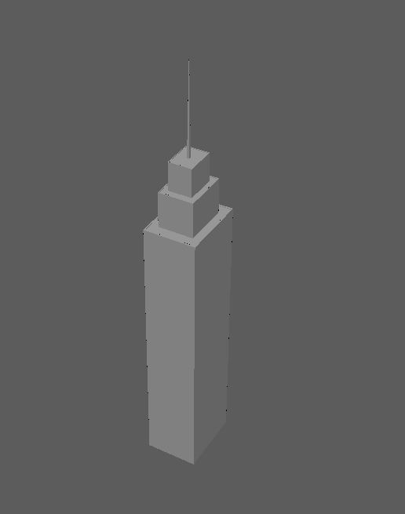
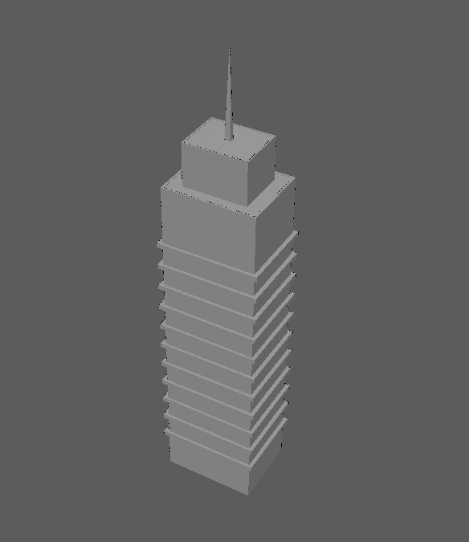

# Homework 6: City Generation

### pennkey and name : lanlou

[DEMO](https://lanlou123.github.io/hw06-city-generation/)
## current progress : building generation

### normal view 



### top down view



## Features:
- **Acceleration structure** , I have been bothered by the performance issue caused by checking every branch in the scene when doing intersection and conjunction checking, with the increasing number of branches generated by turtle, this could be a really heavy burden, then I realized that such large amount of checking is not neccessary at all, recall from the first assaingment in GPU programming course, I only need to check a sorounding area within certain range by using a grid structure, the index of the grid cells will be corresponding to the current position of the checking point, and each time I'm generating a branch(road or highway) I will push this road into a corresponding road array inside a 2-Dimensional array storing the road arrays. therefore in the future when doing the checking, the time complexity is greatly decreased since I will only be checking ```roadnum/numcells```instead of ```roadnum```, the performancce boost is really helpful for me to add more road related building features which I will describe later.
- **Rasterize the Map of road and water**: instead of rasterize these stuff on CPU, I chosed to use Framebuffer and texture to acheive this, there will be in general three passes, first pass, do the instanced rendering of road(a bunch of quad) render to road texture by framebuffer, second pass, render the elevation texture(water information), third pass take in two above texture and combine them in fragment shader, then write to CPU by readpixels for furture use
- **Building generation**: first generate a 100X100 grid extending the entire scene, then foreach cell in the grid generate a random point in it, then use the rasterized buffer from the previous step to determine if we place building here or not, if decided to place one, then record the translation information as mat4


- **Road sensitive buildings**: as can be noticed from the image above, the shape of the building is affected by roads in several aspects: the building is aligning with the heading of the road around it, and is resized depending on the size of the block it is in
  - Size of the building, here is when the acceleration structure I mentioned above come in handy, each of the building points will try to get a closest point to another road in the acceleration cell, and the closest point will be the restriction of the current building, this information will again be recorded as mat4(scale)
  - Orientation of the building : similarily, we check the closest point, this time we will get the owner road of the point, and get the orientation of that road, and use a quaternion to initilize the rotation matrix...

- **shadow mapping**: a little buggy, but looks ok, I used two passes to create shadow effect, one pass render scene objects in light space(light as camera for and orhto mat), after which I get a shadow map from fbo and I generate a texture using it, following pass will be simply first transform fragments into lightspace and compare depth value, then give them color based on the comparison results, the following image is my depth map, instead of using a depth comp, I was using texture component to store the FBO output, and also, since I was doing the simulation on a very small scale(-1~1), I would need to use relatively larger resolution texture so that aliasing is not that overwhelming, therefore, I choosed to use 5Xscreen hight width, which turns out giving me pretty decent results, one thing I need to take care is that not forget to change the storage properties of render buffer and the viewport dimension, and change them back after the shadowmap render to texture pass...


- **building models**: I created a bunch of buildings in maya using a plugin called "Qtown"
The model I made are these:

  - lowesest population dens building type1


  - lowesest population dens building type2



  - mid population dens building type1



  - mid population dens building type2



  - high population dens building type1



  - high population dens building type2



## References:

- [Qtown maya plugin](https://www.highend3d.com/maya/script/free-qtown-for-maya)
- [ Real-time Procedural Generation of 'Pseudo Infinite' Cities](http://citeseerx.ist.psu.edu/viewdoc/download?doi=10.1.1.88.7296&rep=rep1&type=pdf)

